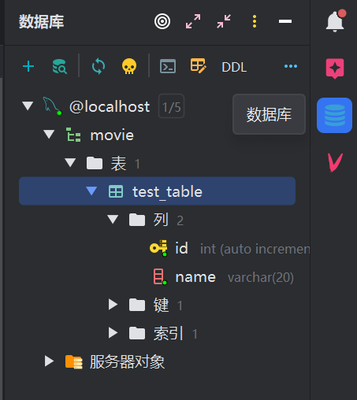
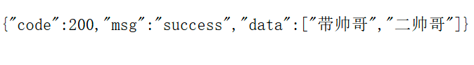
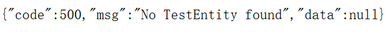

[](https://deepwiki.com/csdstar/MovieRecommender-backend)
# 软件工程基础课程
## 电影推荐项目
### init
​		启动测试前请先在本地设置好MySQL数据库。由于配置文件中设置的数据库url是：
`jdbc:mysql://127.0.0.1:3306/movie`

​		请务必保证数据库是MySQL数据库，设置在3306端口，并在本地数据库创建架构movie。对应的sql指令如下：

```sql
CREATE DATABASE movie;
```

​		在创建数据库架构movie之后，请进入数据库movie，并在movie数据库中建立与本人测试格式相同的表格结构，以防实体类(entity包下的`TestEntity`)识别出错。sql指令如下：

```sql
create table if not exists test_table
(
    id   int auto_increment
        primary key,
    name varchar(20) not null
)
    comment '这是一个用来测试数据库的表';
```

​		在创建了相同格式的表后，可以自由在表中增添行以进行测试。

​		若有intellij IDEA专业版，应当可以打开数据库插件并看到如下样式：



​		初始化的代码中仅实现了两个个简易的controller查询，用来打印该表中的所有数据。如果你前面操作都成功了，在浏览器打开对应网址应该能看到数据库信息。

```http
http://localhost:8080/test/all

http://localhost:8080/test/id_name?id=1&name=%E4%BA%8C%E5%B8%85%E5%93%A5
```


### 2025.5.15补充

​		补充了服务层部分，补充了自定义的异常类，规定了controller函数的输出格式，并新增了一个标准化的controller函数`getAllNameByService`，之后所有的controller函数的实现和输出都应当按照此函数标准实现。

​		注：TestController前面的两个函数实际上都是不合规范的函数，只是为了方便你们理解而写的

​		代码结构补充说明：exception包中是自定义的异常类，result包中是自定义的请求返回格式，包含code, msg, data，utils（目前是空的）中存放各类静态的工具类，日后如果想实现某些静态类静态函数都应放到此包中。

​		dto包存放的是dto数据对象，用于和entity区分。entity中的数据对象应当和数据库数据格式完全匹配，用于存储从数据库中查询的数据。而dto数据对象是 对entity对象二次处理得到的中间数据格式，用于去除冗余字段或是对字段进行一些进一步的处理。

​		service包存放服务类，用于对数据库查询到的数据进行进一步的处理，即二次加工从数据库查询到的entity，转为dto再返回给controller。这一过程中需要进行异常检测，并适时抛出异常，由controller来处理异常。

例如正常时候的输出如下：



数据库为空时抛出错误，controller检测到异常输出如下：



### 2025.5.17
​		设置了github action进行自动同步，每隔2h将gitee仓库同步到github

### 2025.5.18
​		将数据库部署到服务器，已实现远程通信和修改